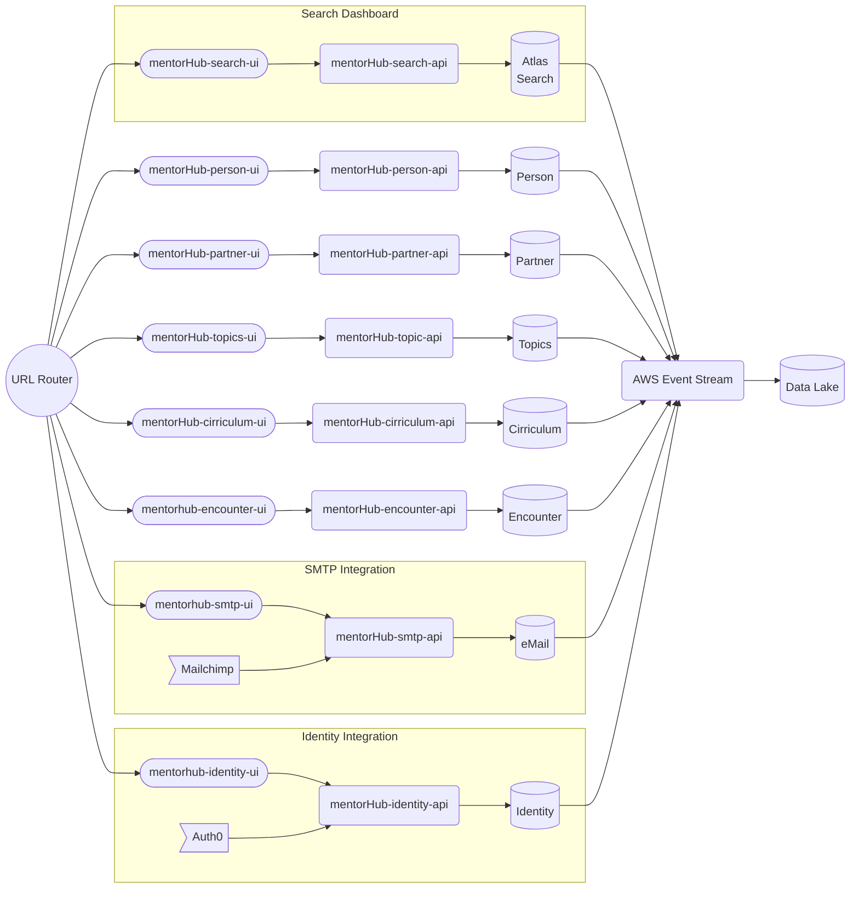
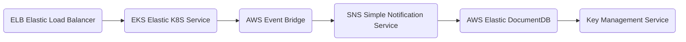
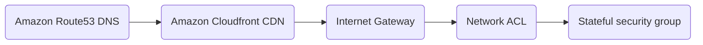
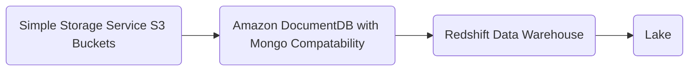
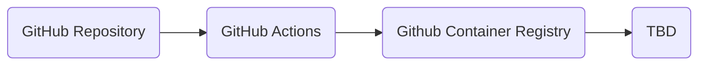
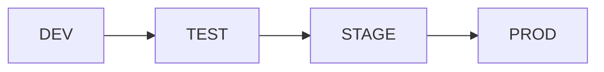

# Solution Architecture

These diagrams utilize the [mermaid flowchart library](https://mermaid.js.org/syntax/flowchart.html), you may need to install an IDE plugin to preview these diagrams. The vsCode extion bierner.markdown-mermaid is a good option.

- [Microservice Architecture](#micorservices-and-source-code-repos)
- [Infrastructure](#infrastructure)
- [Continous Integration](#continous-integration)
- [Continous Delivery](#continous-delivery)

## Micorservices and source code repos

Bounded Domains and Eventually Consistant data, architecture.yaml has details.
Domain source/sync configurations

A special note about the Search domain

Integration domains use request(sync)/reply(source) collections to implement asyncronous functionality. The solution can scale databases along service domains as each domain will be the source for one (or a few) collections, and other domains can use an eventually consistant copy in a read only fashion.

    Auth0 
    --> BUS

    subgraph mentorHub-mongodb
        PersonDB
        TopicsDB
        PartnerDB
        CirriculumDB
        EncounterDB
        IdentityDB
        eMailDB
    end

## Infrastructure

The following diagram identifies the cloud infrastructure used by the mentorHub platform

## Networking

## Storage

## Continous Integration

## Continous Delivery

