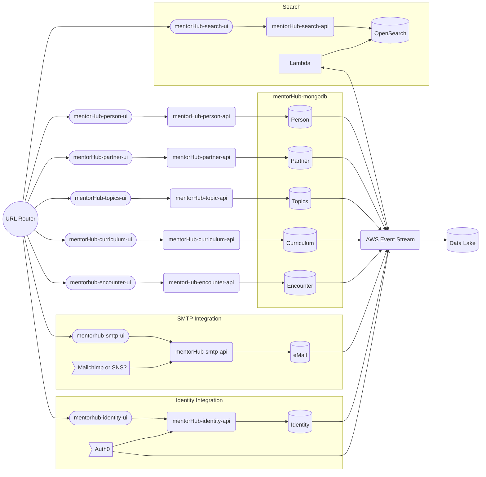
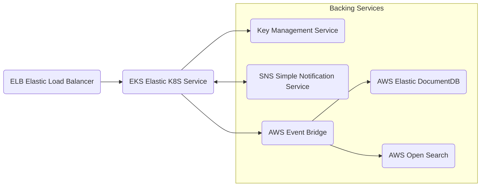
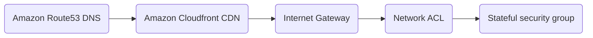
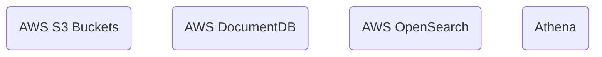
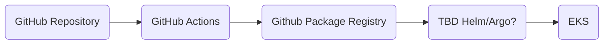

# Solution Architecture

These diagrams utilize the [mermaid flowchart library](https://mermaid.js.org/syntax/flowchart.html), you may need to install an IDE plugin to preview these diagrams. The VS Code extension bierner.markdown-mermaid is a good option.

- [Microservice Architecture](#microservices-and-source-code-repos)
- [Infrastructure](#infrastructure)
- [Networking](#networking)
- [Storage](#storage)
- [Continuous Integration](#continuous-integration)
- [Continuous Delivery](#continuous-delivery)

## Microservices and source code repos

Bounded Domains and Eventually Consistent data, architecture.yaml has details.
Domain source/sync configurations

A special note about the Search domain

Integration domains use request(sync)/reply(source) collections to implement asynchronous functionality. The solution can scale databases along service domains as each domain will be the source for one (or a few) collections, and other domains can use an eventually consistent copy in a read only fashion.

## Infrastructure

The following diagram identifies the cloud infrastructure used by the mentorHub platform.

NOTE: This is incomplete, see the [Configure automation for Continuous Deployment Environments](https://github.com/agile-learning-institute/mentorHub/issues/12) issue for details.

## Networking

NOTE: This is incomplete, see the [Configure automation for Continuous Deployment Environments](https://github.com/agile-learning-institute/mentorHub/issues/12) issue for details.

## Storage

NOTE: This is incomplete, see the [Configure automation for Continuous Deployment Environments](https://github.com/agile-learning-institute/mentorHub/issues/12) issue for details.

## Continuous Integration

NOTE: This is incomplete, see the [Configure automation for Continuous Deployment Environments](https://github.com/agile-learning-institute/mentorHub/issues/12) issue for details.

## Continuous Delivery

The mentorHub platform utilizes four release management environments. Following the 12 factor principles the containers are built once, and then promoted between environments by adding tags to the containers. Environments are provisioned with Terraform automation. Provisioning a new environment (i.e. for training or sales purposes) is achieved with Terraform, deploying code to this new environment only requires adding a new tag to the images you want to deploy.

### DEV

This is a cloud hosted development environment. CI Automation deploys new code directly into this environment. Backing services in this environment are based on containerized database resources which contain test data, and can return to the know starting point by redeploying the containers.

### TEST

This is a cloud hosted testing environment, where end-to-end testing is done to assure the quality of the system before release. This environment also uses containerized backing databases to support automated testing. Once the SQA team determines that the new release has passed quality checks in this environment it can be deployed into the Staging environment.

### STAGE

This is the final Pre-Production environment. In this environment data from the Production environment is replicated into the Staging environment to test database migrations. One last QA check is done in this environment before deploying the release into Production.

### PROD

This is the live production environment.
